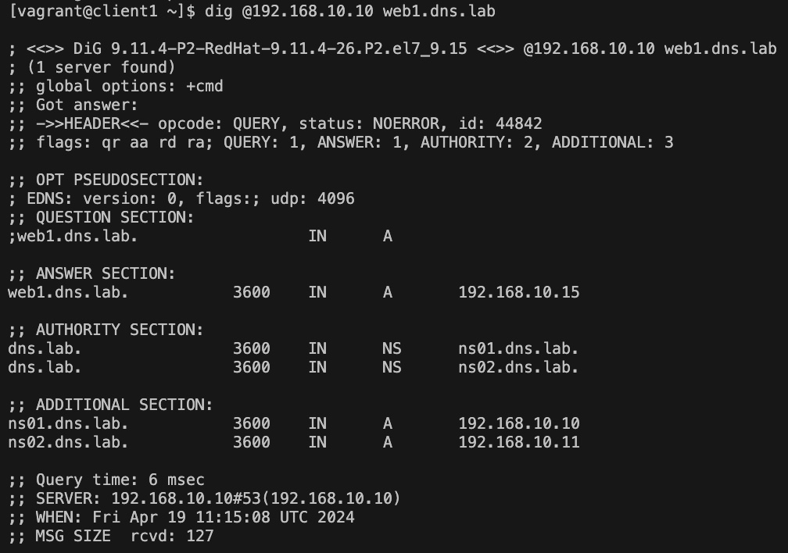

# DNS

### Цель задания
Создать сетевую лабораторию. Изучить основы DNS, научиться работать с технологией Split-DNS в Linux-based системах

### Описание задачи
1. взять стенд https://github.com/erlong15/vagrant-bind 
- добавить еще один сервер client2
- завести в зоне dns.lab имена:
- web1 - смотрит на клиент1
- web2  смотрит на клиент2
- завести еще одну зону newdns.lab
- завести в ней запись
- www - смотрит на обоих клиентов

2. настроить split-dns
- клиент1 - видит обе зоны, но в зоне dns.lab только web1
- клиент2 видит только dns.lab

### Введение
DNS(Domain Name System, Служба доменных имён) -  это распределенная система, для получения информации о доменах. DNS используется для сопоставления IP-адресов и доменных имён.
Сопостовления IP-адресов и DNS-имён бывают двух видов: 
- Прямое (DNS-bмя в IP-адрес)
- Обратное (IP-адрес в DNS-имя)

Доменная структура DNS представляет собой древовидную иерархию, состоящую из узлов, зон, доменов, поддоменов и т.д. «Вершиной» доменной структуры является корневая зона. Корневая (root) зона обозначается точкой. Далее следуют домены первого уровня (.com, ,ru, .org и т. д.) и т д.

В DNS встречаются понятия зон и доменов:
- Зона — это любая часть дерева системы доменных имён, размещаемая как единое целое на некотором DNS-сервере. 
- Домен – определенный узел, включающий в себя все подчинённые узлы. 

Давайте разберем основное отличие зоны от домена. Возьмём для примера ресурс otus.ru — это может быть сразу и зона и домен, однако, при использовании зоны otus.ru мы можем сделать отдельную зону mail.otus.ru, которая будет управляться не нами. В случае домена так сделать нельзя...

FQDN (Fully Qualified Domain Name) - полностью указанное доменное имя, т.е. от корневого домена. Ключевой идентификатор FQDN - точка в конце имени. Максимальный размер FQDN — 255 байт, с ограничением в 63 байта на каждое имя домена. Пример FQDN: mail.otus.ru.

Вся информация о DNS-ресурсах хранится в ресурсных записях. Записи хранят следующие атрибуты:
- Имя (NAME) - доменное имя, к которому привязана или которому принадлежит данная ресурсная область, либо IP-адрес. При отсутствии данного поля, запись ресурса наследуется от предыдущей записи. 
- TTL (время жизни в кэше) - после указанного времени запись удаляется, данное поле может не указываться в индивидуальных записях ресурсов, но тогда оно должно быть указано в начале файла зоны и будет наследоваться всеми записями.
- Класс (CLASS) - определяет тип сети (в 99% используется IN - интернет)
- Тип (TYPE) - тип записи, синтаксис и назначение записи
- Значение (DATA)  

Типы рекурсивных записей:
- А (Address record) - отображают имя хоста (доменное имя) на адрес IPv4
- AAAA - отображает доменное имя на адрес IPv6
- CNAME (Canonical name record/псевдоним) - привязка алиаса к существующему доменному имени
- MX (mail exchange) - указывает хосты для отправки почты, адресованной домену. При этом поле NAME указывает домен назначения, а поле DATA приоритет и доменное имя хоста, ответственного за приём почты. Данные вводятся через пробел
- NS (name server) -  указывает на DNS-сервер, обслуживающий данный домен. 
- PTR (pointer) -  Отображает IP-адрес в доменное имя 
- SOA (Start of Authority/начальная запись зоны) - описывает основные начальные настройки зоны. 
- SRV (server selection) — указывает на сервера, обеспечивающие работу тех или иных служб в данном домене (например  Jabber и Active Directory).

Для работы с DNS (как клиенту) в linux используют утилиты dig, host и nslookup
Также в Linux есть следующие реализации DNS-серверов:
- bind
- powerdns (умеет хранить зоны в БД)
- unbound (реализация bind)
- dnsmasq 
- и т д. 

Split DNS (split-horizon или split-brain) — это конфигурация, позволяющая отдавать разные записи зон DNS в зависимости от подсети источника запроса. Данную функцию можно реализовать как с помощью одного DNS-сервера, так и с помощью нескольких DNS-серверов…  
  
  
  ### Настройка DNS
  
В рамках задачи был подготовлен Vagrantfile, который разворачивает 4 виртуальных машины (ВМ):
  - сервер ns01;
  - сервер ns02;
  - клиент client1;
  - клиент client2.
Развертывание стенда производится командой  ```vagrant up```  
  
Подготовлен playbook, с помощь которого производится конфигурирование серверов ns01, ns02 и клиентские ВМ. Для конфигурирования всех ВМ необходимо выполнить команду ``` ansible-playbook ./ansible/playbook.yml -i ./ansible/hosts.ini ```  
По завершению настройки ВМ можно зайти на любую клиентскую ВМ и проверить получение данных с DNS, используя команду ``` dig @192.168.10.10 web1.dns.lab ```. В результате должны получить следующий вывод:  
  
  


